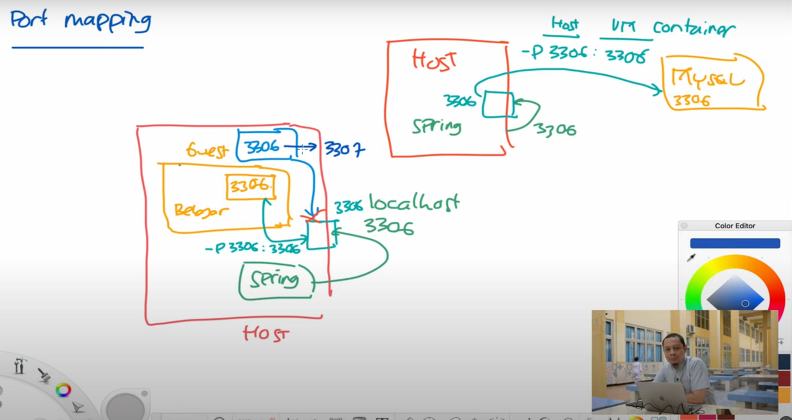

# Setup Docker
1. Concept


refrensi: https://youtu.be/IT3dB-8HxLA?si=_EJlaUSn0lUCjeHZ

Host dan Guest memiliki ip yang berbeda, sehingga ketika host ingin connect ke 3306 guest atau vm maka dia belum bisa connect.
Untuk connect perlu di mapping portnya

2. connect docker
- docker run
```agsl
docker run -e MYSQL_RANDOM_ROOT_PASSWORD=yes -e MYSQL_DATABASE=belajar -e MYSQL_USER=belajar -e MYSQL_PASSWORD=java  mysql:8
```

- docker run dengan port mapping
```agsl
docker run -e MYSQL_RANDOM_ROOT_PASSWORD=yes -e MYSQL_DATABASE=belajar -e MYSQL_USER=belajar -e MYSQL_PASSWORD=java -p 3306:3306 mysql:8
```
-p 3306:3306 = 3306 pertama sebagai host, yang kedua sebagai containernya


- connect docker dengan terminal
```agsl
mysql -h 127.0.0.1 -u root belajar -p
```

3. volume mapping
```agsl
docker run -e MYSQL_RANDOM_ROOT_PASSWORD=yes -e MYSQL_DATABASE=belajar -e MYSQL_USER=belajar -e MYSQL_PASSWORD=java -p 3306:3306 -v /Users/guest1/Documents/Coding/Docker/belajar-docker/db-belajar:/var/lib/mysql mysql:8
```
mengambil file yang ada di doccker
-v directoryhost:directoryvm

4. docker compose
```agsl
services:
  db-belajar:
    image: mysql:8
    environment:
      - MYSQL_RANDOM_ROOT_PASSWORD=yes
      - MYSQL_DATABASE=belajar
      - MYSQL_USER=belajar
      - MYSQL_PASSWORD=java
    ports:
      - 3306:3306
    volumes:
      - ./db-belajar:/var/lib/mysql
```

running docker compose
```agsl
docker compose up
```